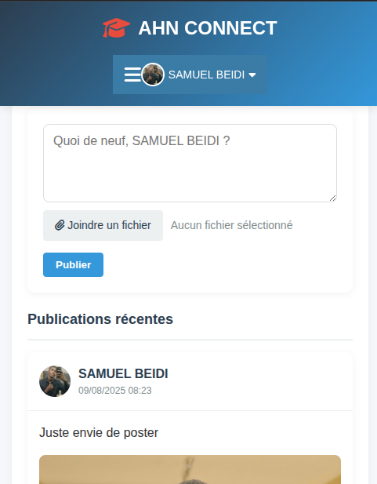
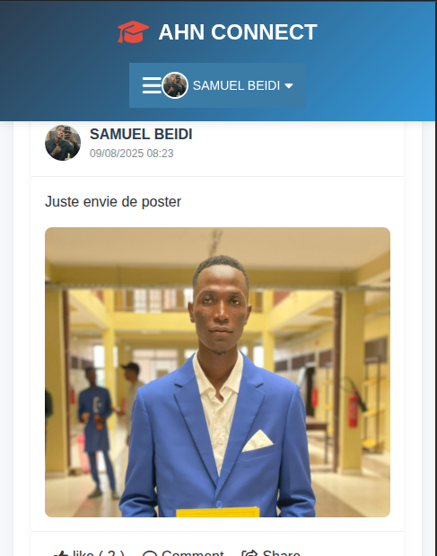
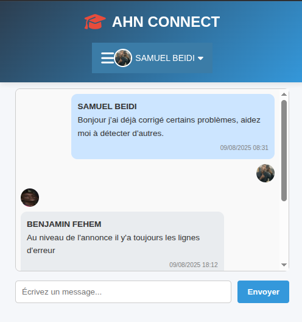
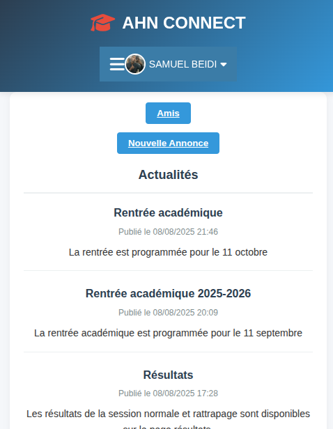
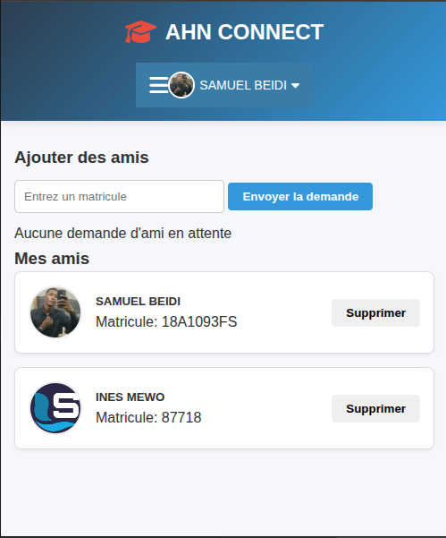
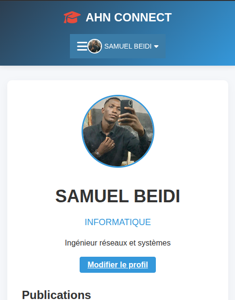
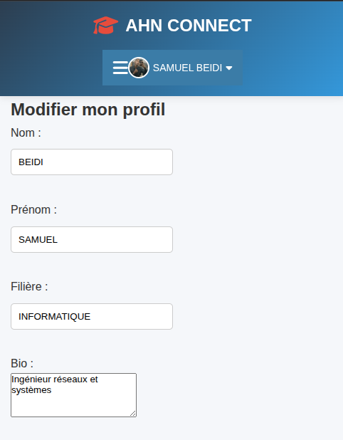

# 🎓 AHN CONNECT

AHN CONNECT est une application web académique qui permet aux étudiants de rester connectés, de partager des actualités, de suivre leurs amis, de consulter les résultats et de recevoir des notifications en temps réel.

---

## 📌 Fonctionnalités principales

- **Authentification sécurisée** (connexion/déconnexion avec sessions PHP)
- **Profil utilisateur** avec photo, nom et menu déroulant
- **Fil d’actualité** pour publier et consulter des posts
- **Gestion des amis** et suivi des publications
- **Notifications en temps réel** (likes, commentaires, actualités)
- **Affichage des résultats académiques**
- **Interface responsive** adaptée aux mobiles et ordinateurs

---

## 🖼️ Aperçu de l'application

### **Fil d’actualité**





### **Menu de chat**


### **Menu des actus**


### **Menu des amis**


### **Menu de profil**


### **Menu de Edit profil**


---

## 🛠️ Technologies utilisées

- **Backend :** PHP 8+, MySQL
- **Frontend :** HTML5, CSS3, JavaScript (AJAX)
- **Base de données :** MySQL (table `etudiants` pour la gestion des comptes)
- **Gestion des sessions :** PHP Sessions
- **Notifications :** AJAX polling
- **Design :** CSS personnalisé + Responsive Design

---

## 📂 Structure du projet

```bash
AHN-Connect/
│
├── db.php               # Connexion à la base de données
├── header.php           # En-tête et menu
├── footer.php           # Pied de page
├── index.php            # Page d’accueil avec fil d’actualité
├── amis.php             # Liste et gestion des amis
├── resultats.php        # Consultation des résultats
├── notifications.php    # Gestion et affichage des notifications
├── assets/              # CSS, JS et images
└── uploads/             # Photos de profil et images postées
```
