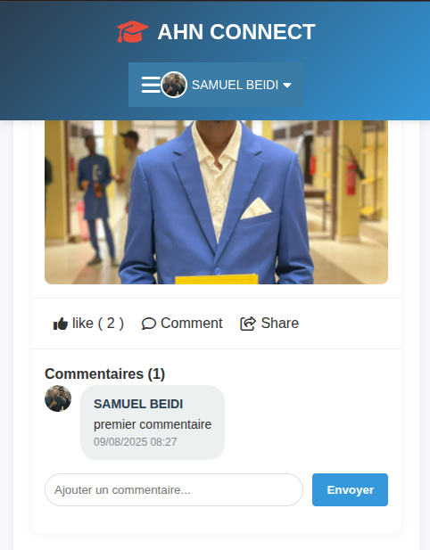

# AHN Connect 🚀

[]()
[]()
[]()
[]()
[]()

---

## 📌 Aperçu du projet

**AHN Connect** est une plateforme sociale académique permettant aux étudiants de communiquer, partager et collaborer en temps réel.  
Elle intègre un fil d’actualités, un système de likes et de commentaires, des notifications instantanées et une gestion des amis.

---

## 🎯 Fonctionnalités

- 🔐 **Authentification** : Inscription, connexion, déconnexion, sessions sécurisées
- 👤 **Profil utilisateur** : Nom, prénom, photo de profil, infos personnelles
- 📰 **Fil d’actualités** : Publications texte/images, likes, commentaires, mise à jour dynamique via AJAX
- 🤝 **Amis** : Ajout, suppression, liste avec photo et infos
- 🔔 **Notifications en temps réel** : Likes, commentaires, invitations
- 📢 **Actualités départementales** : Annonces officielles

---
## 🖼️ Aperçu de l'application

### **Fil d’actualité**




### **Menu de chat**


### **Menu des actus**


### **Menu des amis**


### **Menu de profil**


### **Menu de Edit profil**


---

## 🛠️ Technologies utilisées

- **Backend :** PHP 8+, MySQL
- **Frontend :** HTML5, CSS3, JavaScript (AJAX)
- **Base de données :** MySQL (table `etudiants` pour la gestion des comptes)
- **Gestion des sessions :** PHP Sessions
- **Notifications :** AJAX polling
- **Design :** CSS personnalisé + Responsive Design

---

## 📂 Structure du projet

```bash
AHN-Connect/
│
├── db.php               # Connexion à la base de données
├── header.php           # En-tête et menu
├── footer.php           # Pied de page
├── index.php            # Page d’accueil avec fil d’actualité
├── amis.php             # Liste et gestion des amis
├── resultats.php        # Consultation des résultats
├── notifications.php    # Gestion et affichage des notifications
├── assets/              # CSS, JS et images
├── uploads/             # Photos de profil et images postées
├── assets/             # CSS, JS, images
├── uploads/            # Fichiers et photos uploadés
├── functions.php       # Fonctions globales
├── login.php           # Connexion utilisateur
├── register.php        # Inscription
├── notifications.php   # Gestion des notifications
└── ...
```
## 📦 Installation

1. **Cloner le projet**
   ```bash
   git clone https://github.com/votre-utilisateur/ahn-connect.git
   ```
2. Placer le dossier dans le serveur
* Déposer dans htdocs (XAMPP) ou équivalent.
3. Créer la base de données
* Importer database.sql dans phpMyAdmin
4. Configurer la connexion
* Dans db.php, modifier si besoin :
```php
  $conn = new mysqli("localhost", "root", "", "gestion_etudiants");
```
5. Lancer le projet
* Ouvrir dans le navigateur :
```php
http://localhost/ahn-connect/
```
